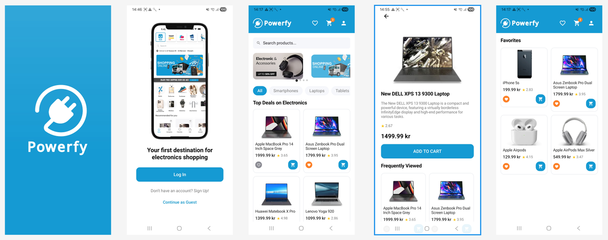
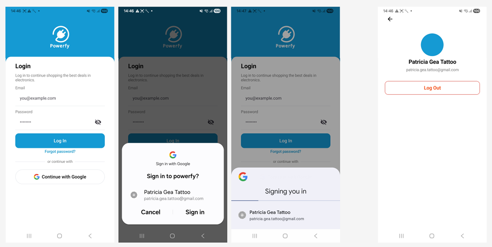
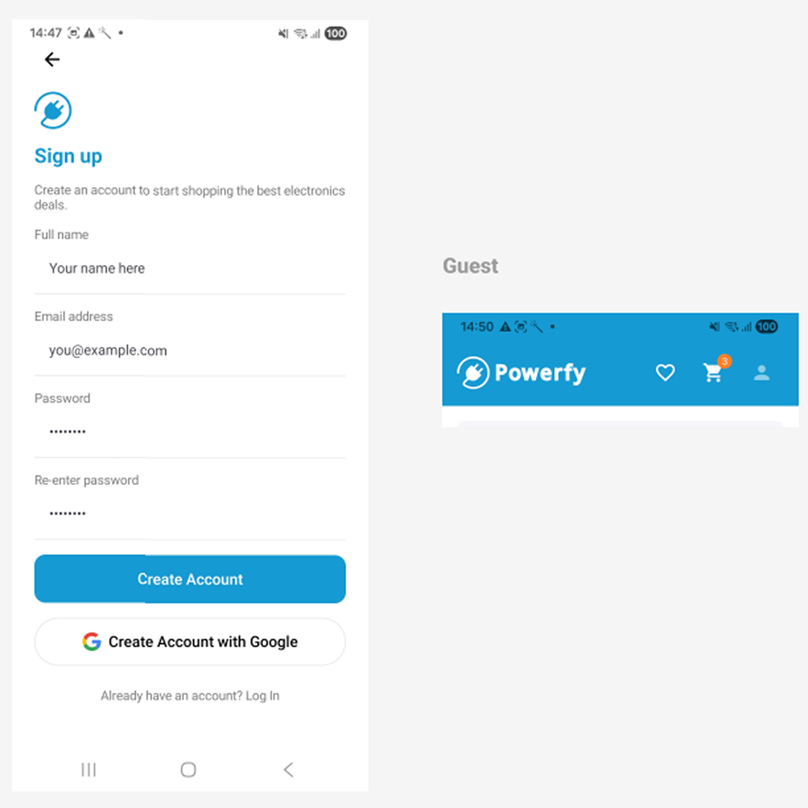
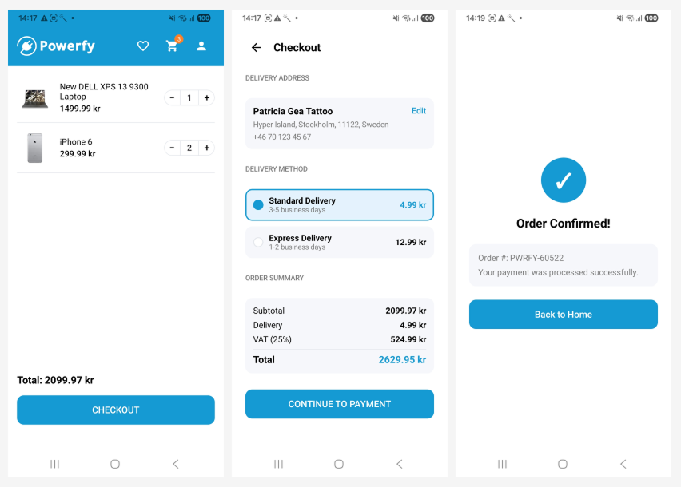
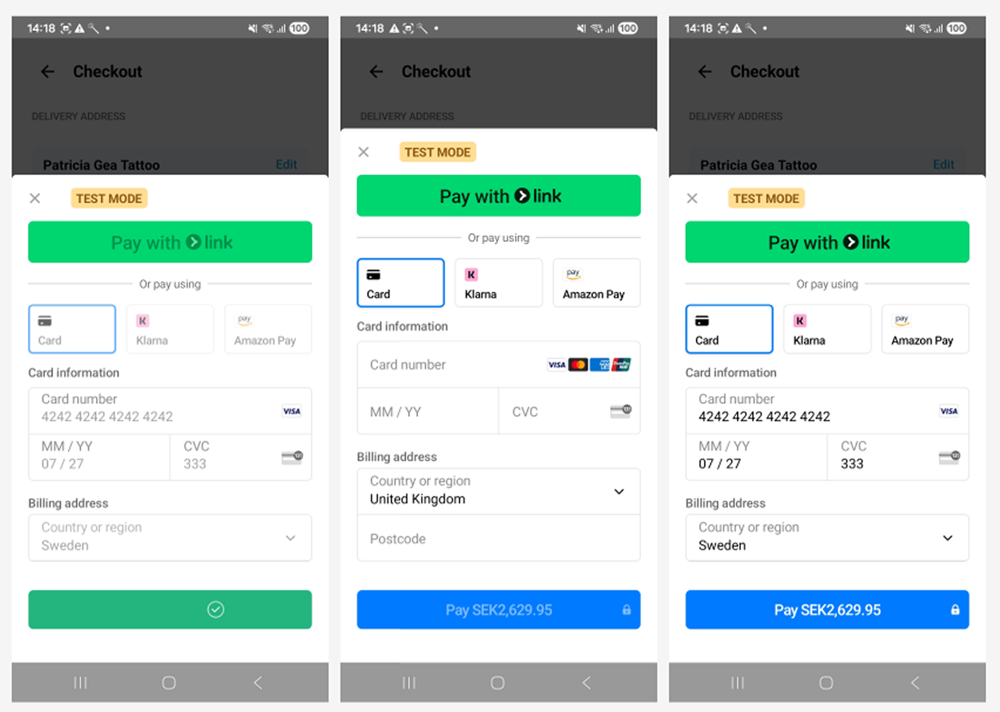
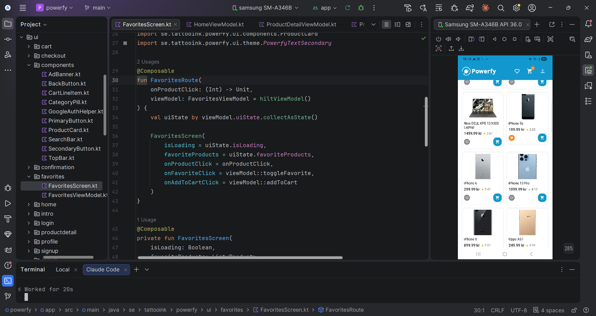

# Powerfy 🔌

A native Android e-commerce app for electronics, designed in Figma and built from scratch in Kotlin with Jetpack Compose, with a real authentication, database, and payment backend behind it. 

Built as a portfolio to demonstrate a complete, production-shaped mobile android app.

**The concept, name, branding, and UI/UX design are original work by the author**, designed in Figma before any code was written.

##  Screenshots

Splash, Intro, Home, Detail, Favorite:




Login, Login by Google O Auth, Logged:




Sign Up, Guest mode:




Cart, Checkout, Confirmed:




Stripe Sheet Payment:




Dev Mode:



##  Objective

Powerfy demonstrates my ability to design and develop a professional Android application using industry relevant technologies and practices.

The project translates a Figma design into a functional application with Kotlin and Jetpack Compose, implementing Firebase Authentication, local data persistence, backend integration, and Stripe test mode payments.

It is designed as a portfolio project to demonstrate the ability to build complete application that can be applied to real world products.

## Overview

Powerfy lets users browse electronics (smartphones, laptops, tablets, and mobile accessories) pulled live from a public product API, view product details, favorite and add items to a persistent cart, and complete a full checkout → payment → confirmation flow with a real Stripe integration.

- **Platform:** Android (min SDK 26 / Android 8.0)
- **Language:** Kotlin
- **UI:** Jetpack Compose + Material 3
- **Product data:** [DummyJSON](https://dummyjson.com/) (public REST API, product catalog and images)
- **Auth & user data:** Firebase Authentication (email/password, Google Sign-In, anonymous/guest) + Cloud Firestore
- **Local persistence:** Room (favorites, cart — survives app restarts)
- **Payments:** Stripe, test mode, via a dedicated Cloud Functions backend (see Payments backend, below)
- **Status:** All 11 screens implemented, full user flow working end to end

## 📱 Screens

| # | Screen | What it does |
|---|--------|---------------|
| 00 | Splash | Checks for an existing session and routes to Home or Intro |
| 00b | Intro | Entry point — Log in, Sign up, or Continue as Guest |
| 01 | Login | Email/password + Google Sign-In, both backed by Firebase Auth |
| 02 | Sign Up | Account creation (Firebase Auth + Firestore profile), also supports Google |
| 03 | Home | Product grid from a live API, category ads carousel, search bar |
| 04 | Product Detail | Full product info, "frequently viewed" from the same category |
| 05 | Favorites | Persisted locally with Room, reflected live across the app |
| 06 | Cart | Persisted locally with Room, quantity stepper, running total |
| 07 | Checkout | Delivery method selection, VAT calculation, order summary |
| 08 | Payment | Stripe's native `PaymentSheet` — a real payment integration in test mode |
| 09 | Confirmation | Order confirmation screen after a successful payment |
| — | Profile | Logged-in user info + logout |

## Architecture

The app follows **MVVM** with a clean separation between data, domain, and UI layers:

```
se.tattooink.powerfy/
├── data/
│   ├── remote/          # Retrofit API interfaces + DTOs (DummyJSON — products only)
│   ├── firebase/        # Firebase Auth + Firestore data sources (users)
│   ├── local/            # Room database, DAOs, entities, and hand-written migrations
│   └── repository/      # Repository implementations
├── domain/
│   ├── model/            # Clean domain models (no DTOs leaking into UI)
│   └── repository/       # Repository interfaces (Product, Auth, Cart, Favorite)
├── di/                    # Hilt modules (network, Firebase, Room, Stripe)
├── navigation/            # Navigation Compose graph, routes, and the app-level Scaffold
└── ui/
    ├── theme/             # Design tokens (color, type, shape, spacing) — sourced from Figma
    ├── components/        # Reusable composables (ProductCard, TopBar, PrimaryButton, ...)
    └── <feature>/          # One package per screen (splash, home, cart, checkout, ...)
```

**Why this structure:** it keeps networking and business logic independent of Compose, makes each screen testable in isolation, and mirrors the layering expected in professional Android codebases. Product data (API - DummyJSON), user/auth data (Firebase), local persistence (Room), and payments (Stripe) are four separate data sources, each behind its own repository interface, swapping any one of them later wouldn't touch the others.

**A pattern worth calling out:** the `TopBar` (logo, favorites icon, cart icon with a live item-count badge, profile icon) is declared **once**, at the `Scaffold` level in the navigation graph — not duplicated per screen. Each screen only exposes plain `() -> Unit` callbacks; navigation and shared UI state (login status, cart count) are resolved centrally. This keeps the `TopBar` reusable and fully decoupled from navigation, and means adding a new screen that needs it costs one line, not a rebuild of the component.

## Tech stack

| Purpose | Library |
|---|---|
| UI | Jetpack Compose + Material 3 |
| Navigation | Navigation Compose (single `Scaffold`, centralized top bar) |
| Dependency injection | Hilt |
| Networking (products) | Retrofit + kotlinx.serialization |
| Auth | Firebase Authentication (email/password, Google, anonymous) |
| User data | Cloud Firestore |
| Local persistence | Room, with hand-written `Migration`s (see below) |
| Payments | Stripe Android SDK (`PaymentSheet`) + a dedicated Firebase Cloud Functions backend |
| Image loading | Coil |
| Async | Kotlin Coroutines + Flow |
| Testing | JUnit + Compose UI Testing *(planned)* |

### A note on login and payment

Login/sign-up and payment are **real integrations**, not mocked:

- **Login / Sign up** use Firebase Authentication — email/password, Google Sign-In (via Credential Manager), and an anonymous guest mode. User profile data is stored in Cloud Firestore.
- **Payment** uses the real Stripe Android SDK (`PaymentSheet`) talking to a real backend (see below), in Stripe's **test mode** — the integration, validation, and error handling behave exactly like production, but no real card is charged. This is standard practice for demoing a payment flow safely.
- **Product catalog only** comes from API - DummyJSON — everything about the user, their cart, and the transaction is real infrastructure the author built and owns.

Because of this, running the project requires a Firebase project (`google-services.json`), a Stripe test-mode publishable key, and the companion backend deployed 

## 💳 Payments backend

Stripe requires PaymentIntent creation server-side, keeping the secret API key out of the Android app entirely. Powerfy uses a dedicated backend for this: powerfy-backend, a Firebase Cloud Function (TypeScript) that creates the PaymentIntent and returns only the temporary client_secret needed to open Stripe's payment sheet.

Security measures in that backend:
- **Requires a valid, logged-in Firebase user.** The function checks `request.auth` before doing anything — an unauthenticated request is rejected before it ever reaches Stripe, which also protects against anyone spamming the endpoint to run up API usage.
- **The Stripe secret key lives in Google Cloud Secret Manager**, injected into the function at runtime — it's never committed to source control or bundled into the app.
- **A billing spend cap is configured** on the Firebase project (Blaze plan), as a safety net against unexpected usage costs while the project is in development.

## Design system
Design tokens are defined in `ui/theme/` and sourced directly from the Figma file ("Powerfy - Rebuilt (Dev Ready)"), which the author designed from scratch:
| Token | Value |
|---|---|
| Primary |  `#159AD3` |
| Accent |  `#FF8026` |
| Background |  `#FFFFFF` |
| Surface / cards |  `#F5F7FA` |
| Secondary text |  `#7A7A7A` |
| Border |  `#E5E8EC` |


## Local storage: Room, with real migrations

Favorites and cart items are persisted locally with Room. Schema changes use **real, hand-written `Migration` objects** (see `data/local/Migrations.kt`) rather than `fallbackToDestructiveMigration()`.

 `fallbackToDestructiveMigration()` During development, the database can be recreated when the schema changes. This is fast, but it deletes existing data. Powerfy uses database migrations instead, so data is preserved when the schema changes.

 `fallbackToDestructiveMigration()`During development, the database can be recreated when the schema changes. This is fast, but it deletes existing data. Powerfy uses database migrations instead, so data is preserved when the schema changes.

## Data sources

### Products — DummyJSON
Product catalog and images only. [API - DummyJSON](https://dummyjson.com/) is a free REST API for prototyping:
 
```
GET /products                          # all products
GET /products/category/smartphones     # smartphones
GET /products/category/laptops         # laptops
GET /products/category/tablets         # tablets
GET /products/category/mobile-accessories  # accessories
GET /products/search?q={query}         # search
GET /products/{id}                     # product details
```

### Users - Firebase
- **Authentication:** email/password, Google Sign-In, and anonymous guest mode via Firebase Auth.
- **Firestore collection:** `users/{uid}` (name, email).

### Payments - Stripe (test mode), via [powerfy-backend](https://github.com/PatriciaGea/powerfy-backend)
Checkout calls a Firebase Cloud Function to create a `PaymentIntent`, then opens Stripe's `PaymentSheet` with the returned client secret. Test card numbers (e.g. `4242 4242 4242 4242`, any future expiry, any CVC) simulate successful and failed payments without moving real money.

### A note on currency
The API provides prices in USD and it's displayed in SEK. However, the currency can be changed to any currency, for both display and Stripe payments.

## Configuration

Running this project requires a Firebase project (Authentication + Firestore enabled, Blaze plan for the Cloud Functions backend), a Stripe account with test-mode keys, and the companion [powerfy-backend](https://github.com/PatriciaGea/powerfy-backend) deployed to that same Firebase project.

- `app/google-services.json` — Firebase config for the Android app (package `se.tattooink.powerfy`)
- `local.properties` → `STRIPE_PUBLISHABLE_KEY` — Stripe test-mode publishable key, kept out of version control
- `powerfy-backend`'s `createPaymentIntent` Cloud Function must be live for the payment flow to work


## Author

**Patricia Gea**: Web / Mobile developer

Hyper Island - Yrkeshogskolan (YH) - Higher Vocational Education (HVE) - Stockholm 

The Powerfy concept, brand, art design , and UI/UX design are original work, designed by Patricia Gea

[GitHub](https://github.com/PatriciaGea)

https://patriciageadev.vercel.app/


                                                                                               
                                                                                               
                                                                                               
                                                                                                    
                                                                                                    
